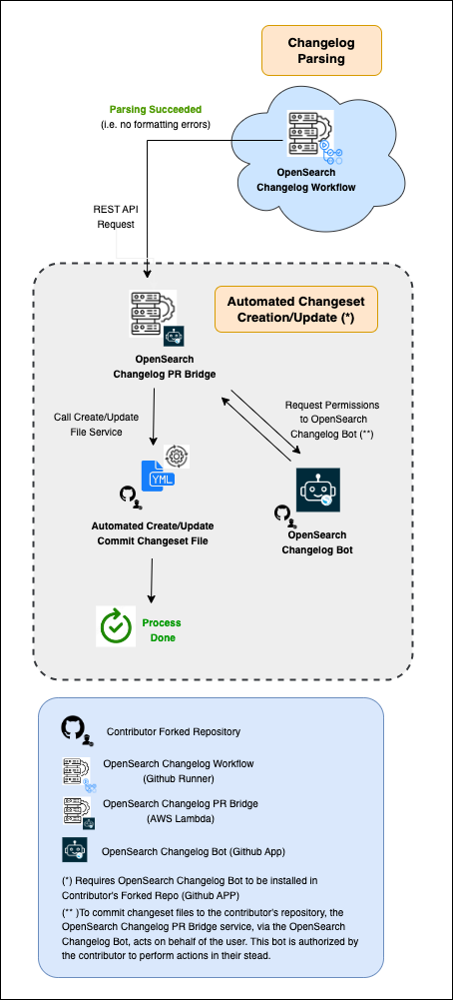

<!-- prettier-ignore-start -->
<!-- omit in toc -->
# OpenSearch Changelog PR Bridge
<!-- prettier-ignore-end -->

<!--  -->

This repository contains the details and source code for **OpenSearch Changelog PR Bridge** service, part of the new broader **Automated Changelog and Release Notes Process** adopted by the [OpenSearch Project](https://opensearch.org/). It presents comprehensive information on how this service works and interacts with the [OpenSearch Changelog Bot](https://github.com/apps/opensearch-changeset-bot) and [OpenSearch Changelog Workflow](https://github.com/BigSamu/OpenSearch_Parse_Changelog_Action), including also guidelines on how to contribute.

For more information about the **Automated Changelog and Release Notes Process** as a whole, please refer to [OpenSearch Changelog Workflow and Release Notes Script](https://github.com/BigSamu/OpenSearch_Parse_Changelog_Action) repository.

<!-- prettier-ignore-start -->
<!-- omit in toc -->
## 1. Table of Contents
<!-- prettier-ignore-end -->

- [2. Process Overview](#2-process-overview)
- [3. Installation](#3-installation)
- [4. Usage](#4-usage)
- [5. Mantainers](#5-mantainers)
- [6. Contributing](#6-contributing)
- [7. License](#7-license)
- [8. Need Help?](#8-need-help)

## 2. Process Overview

As explained in [OpenSearch Changelog Workflow and Release Notes Script](https://github.com/BigSamu/OpenSearch_Parse_Changelog_Action), **OpenSearch Changelog PR Bridge** is a minimal service interacting with **OpenSearch Changelog Workflow**, used to commit changeset files on behalf of a contributor. The idea behind this is that if a contributor wants to use the option for an `Automated Changeset Creation/Update` job, then he can install a GitHub App - **[OpenSearch Changelog Bot](https://github.com/apps/opensearch-changeset-bot)** - to include this feature in his forked repository. This App, once set up, allows the **OpenSearch Changelog PR Bridge** to operate on behalf of the contributor, as specific permissions are granted by him during this installation process.

In this manner, when **OpenSearch Changelog Workflow** service sends a request to the **OpenSearch Changelog PR Bridge** service, the latter is enabled to commit changeset files to the contributor's repository, as it possesses the necessary permissions for this action. Below is a diagram illustrating this overall process.

## 3. Installation

In order to use the **OpenSearch Changelog Workflow** service for automatic creation or update of changeset files in any of your OpenSearch forked repos:

- Navigate to the [OpenSearch-bot](https://github.com/apps/opensearch-changeset-bot) installation page and click "Install".
- Follow the instructions there and only install this App in all forked OpenSearch repositories where you want to have this feature activated.

## 4. Usage

In your opened PR, add the changelog entries on your PR description under the `## Changelog`` section. If the entry is valid (i.e., parsing succeeds) or there is not a `- skip`` entry, then a valid changeset file will be created on your forked repository. A commit message like the one below will appear in the PR conversation panel of GitHub web UI:

For more references on how to create a valid changelog entry, please refer to [OpenSearch Changelog Workflow and Release Notes Script](https://github.com/BigSamu/OpenSearch_Parse_Changelog_Action) repository.

## 5. Mantainers

- [Samuel Valdes Gutierrez](https://github.com/BigSamu) - OpenSearch Slack [link](https://opensearch.slack.com/archives/D05T6HWHLG3)
- [Johnathon Bowers](https://github.com/JohnathonBowers) - OpenSearch Slack [link](https://opensearch.slack.com/archives/D06075U158Q)

## 6. Contributing

The **Automated Changelog Release Notes Process** is the result of a concerted effort by OpenSearch maintainers and contributors to improve the development experience for all involved in OpenSearch suite.

Contributions to the **OpenSearch Changelog PR Bridge** are welcome! See our [Developer Guide](./DEVELOPER_GUIDE.md) for instructions on how to set up the project in your local environment and [CONTRIBUTING.md](./CONTRIBUTING.md) for guidelines.

## 7. License

This project is an open-source product released under the Apache 2.0 license (see either [the Apache site](https://www.apache.org/licenses/LICENSE-2.0) or the [LICENSE.txt file](./LICENSE.txt)). The Apache 2.0 license allows you to freely use, modify, distribute, and sell your own products that include Apache 2.0 licensed software.

## 8. Need Help?

Feel free to contact us in the slack channel or by oppening an issue in this repo.
